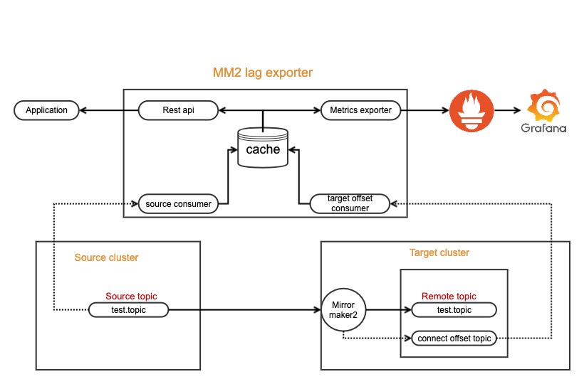
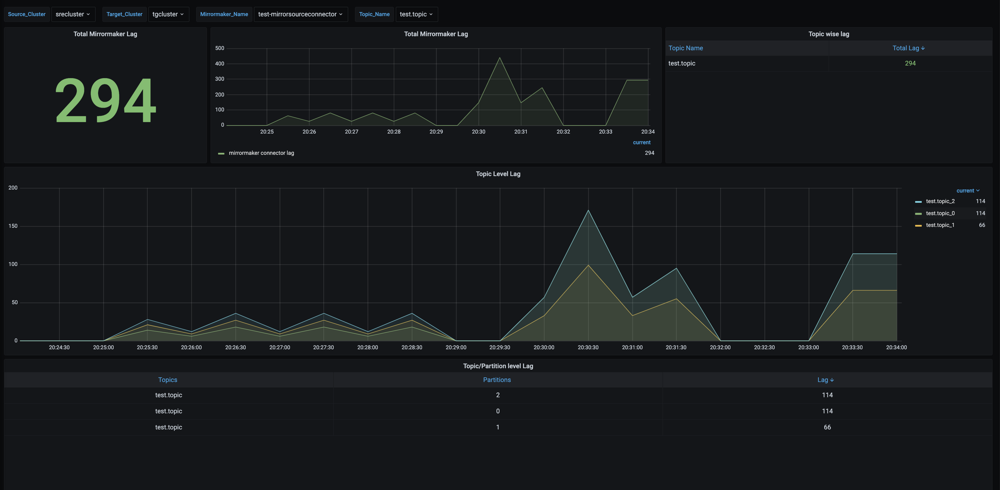

# MM2 Lag Exporter

## Mirrormaker 2

Apache Kafka MirrorMaker2 replicates data across two Kafka clusters, within or across data centers. MirrorMaker takes 
messages from a source Kafka cluster and writes them to a target Kafka cluster.

## MM2 Lag Exporter

This application monitors the mirror maker 2 replication process and calculates the mirroring lag between source and 
target cluster topics.These lag details are exposed as REST endpoints and as well as prometheus metrics which can be visualized in grafana dashboard.

## Architecture



For LagExporter to calculate the lag, it requires topic partition logend offset and MM2 current offset.When MM2 replicates the data, it commits the offsets (current offsets) in connect-offset topic in the destination cluster.LagExporter creates 2 consumers , one for retrieving logend offset information from source cluster and one for retrieving current offset information from target cluster. This logend offset and mm2 current offset informations are sent to prometheus metrics and also exposed a REST end point for checking current lag information.

## Features

1. HTTP endpoints for mirrormaker2 process current lag details, source and target consumer status.
2. Below prometheus metrics are exposed
   1. source topic Logend offset information.
   2. target topic current offset information.

## Compatibility

* Support [Apache Kafka](https://kafka.apache.org) version 2.7.0 (and later).
* Java 8 or higher

## Configuration

#### Edit the application.properties file and add the below configs.
##### Note : For applying configurations during deployment, specifically for passwords and secrets, inject them into environment variables during the time of deployment.(For Example, via Environment configuration, Kubernetes secrets, vault integration etc)

| Flag name                           | Default        | Description                                                                                                                            |  
|-------------------------------------|----------------|----------------------------------------------------------------------------------------------------------------------------------------|  
| `source.cluster.bootstrap.servers`          |                     | Addresses (host:port) of source Kafka cluster                                                                                       |  
| `source.cluster.alias`                      |                     | source cluster alias                                                                                                               |  
| `source.consumer.groupid`                   |                     | Consumer group name of the source consumer                                                                                       |  
| `target.cluster.bootstrap.servers`          |                     | Addresses (host:port) of source Kafka cluster                                                                                    |  
| `target.cluster.alias`                      |                     | source cluster alias                                                                                                             |  
| `target.consumer.groupid`                   |                     | Consumer group name of the target consumer                                                                                       |  
| `connect.offset.topic`                      |                     | Connect offset internal topic name in the target kafka cluster                                                                   |  
| `connectors`                                |                     | Name of the mirrormaker2 connectors and topics.If multiple mirror source connectors are running with same source and target cluster means those connectors can be added like below { 'connector1-name':'topic1,topic2','connector2-name':'topic3,topic4' }                                                                                |  
| `consumer.ssl.enabled`                      | false               | whether ssl is enabled to connect to kafka clusters.true or false                                                                |  
| `management.endpoints.web.exposure.include` | health,prometheus   |                                                                                                                  |  
| `auto.restart.onfailure.enabled`            | false               | Incase of consumer failures whether to restart automatically|

consumer.ssl.enabled= true  
If SSL or SASL configurations are enabled then the configs can be provided prefixing '_source_' or '_target_' with kafka ssl configs.


#### Example:

source.security.protocol= [ security protocol for connecting to source bootstrap urls. eg: SSL]  
source.ssl.truststore.type= [ source truststore file type. eg: JKS]  
source.truststore.path= [ source truststore path]  
source.truststore.password= [ password for truststore file ]  
source.ssl.endpoint.identification.algorithm= [ endpoint identification algorithm]  

target.security.protocol= [security protocol for connecting to Target bootstrap urls. eg: SSL_SASL]  
target.ssl.truststore.type= [truststore file type. eg: JKS]  
target.sasl.mechanism= [security protocol for connecting to Target bootstrap urls. eg: SCRAM-SHA-512 ]  
target.sasl.Jaas.config= [ Jaas config ]  
target.truststore.path= [ truststore path]   
target.truststore.password= [ password for truststore file ]  
target.ssl.endpoint.identification.algorithm=[ endpoint identification algorithm ]  

## Development

1. Clone this GitHub repository.
2. To create a packaged version, optionally skipping the tests:
```bash  
mvn package [-DskipTests]
```
3. Look for ```mm2-lag-exporter-<version>.jar``` under the target directory.

## Deployment

#### Run As Java project

1. Place the jar with dependencies.
2. Open a bash or CMD in the same directory as the .jar.
3. Run: `java -jar mm2-lag-exporter-<version>.jar` .

#### Run As Docker Image

#### Local

1. Build
```shell
docker build -t mm2-lag-exporter
```  
2. Run the docker image
```shell
docker run -it mm2-lag-exporter
```  

## Quickstart API Usage examples

```bash 
# status the Source consumer 
$ curl -X GET http://localhost:8080/source-consumer/status  
  {"TYPE": "Source","STATUS": "RUNNING"}  

# Restarts the Source consumer 
$ curl -X POST http://localhost:8080/source-consumer/restart  
  
# status the Source consumer 
$ curl -X GET http://localhost:8080/target-consumer/status  
  {"TYPE": "Source","STATUS": "RUNNING"}  

# Restarts the Source consumer 
$ curl -X POST http://localhost:8080/target-consumer/restart  
  
# Fetch mm2 lag for all the topics 
$ curl -X GET http://localhost:8080/lag  
  {
    "name": "test-mirrorsourceconnector",
    "sourceClusterBrokerUrl": "source_broker:9092",
    "targetClusterBrokerUrl": "target_broker:9092",
    "sourceClusterAlias": "srecluster",
    "targetClusterAlias": "tgcluster",
    "connector": {
        "test-mirrorsourceconnector": {
            "connectorName": "test-mirrorsourceconnector",
            "topics": {
                "test-topic": {
                    "topicName": "test-topic",
                    "partitions": {
                        "0": {
                            "topicName": "test-topic",
                            "partition": 0,
                            "logEndOffset": 110,
                            "logEndOffsetUpdatedAt": "2022-05-24T09:34:27.181+00:00",
                            "mmOffset": 100,
                            "mmOffsetUpdatedAt": "2022-05-24T09:33:21.129+00:00",
                            "lag": 10
                        },
                        "1": {
                            "topicName": "test-topic",
                            "partition": 1,
                            "logEndOffset": 100,
                            "logEndOffsetUpdatedAt": "2022-05-24T09:34:27.181+00:00",
                            "mmOffset": 100,
                            "mmOffsetUpdatedAt": "2022-05-24T09:33:16.818+00:00",
                            "lag": 0
                        },
                        "2": {
                            "topicName": "test-topic",
                            "partition": 2,
                            "logEndOffset": 100,
                            "logEndOffsetUpdatedAt": "2022-05-24T09:34:27.181+00:00",
                            "mmOffset": 100,
                            "mmOffsetUpdatedAt": "2022-05-24T09:33:21.079+00:00",
                            "lag": 0
                        }
                    }
                }
            }
        }
    }
  }

# Fetch mm2 lag for specific topic 
$ curl -X GET http://localhost:8080/lag?topic=test-topic  
  {
    "name": "test-mirrorsourceconnector",
    "sourceClusterBrokerUrl": "source_broker:9092",
    "targetClusterBrokerUrl": "target_broker:9092",
    "sourceClusterAlias": "srecluster",
    "targetClusterAlias": "tgcluster",
    "connector": {
        "test-mirrorsourceconnector": {
            "connectorName": "test-mirrorsourceconnector",
            "topics": {
                "test-topic": {
                    "topicName": "test-topic",
                    "partitions": {
                        "0": {
                            "topicName": "test-topic",
                            "partition": 0,
                            "logEndOffset": 110,
                            "logEndOffsetUpdatedAt": "2022-05-24T09:34:27.181+00:00",
                            "mmOffset": 100,
                            "mmOffsetUpdatedAt": "2022-05-24T09:33:21.129+00:00",
                            "lag": 10
                        },
                        "1": {
                            "topicName": "test-topic",
                            "partition": 1,
                            "logEndOffset": 100,
                            "logEndOffsetUpdatedAt": "2022-05-24T09:34:27.181+00:00",
                            "mmOffset": 100,
                            "mmOffsetUpdatedAt": "2022-05-24T09:33:16.818+00:00",
                            "lag": 0
                        },
                        "2": {
                            "topicName": "test-topic",
                            "partition": 2,
                            "logEndOffset": 100,
                            "logEndOffsetUpdatedAt": "2022-05-24T09:34:27.181+00:00",
                            "mmOffset": 100,
                            "mmOffsetUpdatedAt": "2022-05-24T09:33:21.079+00:00",
                            "lag": 0
                        }
                    }
                }
            }
        }
    }
  }
```  

## Prometheus Metrics

### Mirrormaker2 Lag Metrics details

This application provides the following metrics on the corresponding HTTP endpoint.

| Name                                               | Exposed information                            |  
| -------------------------------------------------- | -----------------------------------------------|  
| `mirrormaker_source_topics_logendoffset`           | Log end Offset of the source topics            |  
| `mirrormaker_currentoffset`                        | Current Offset of the topics                   |

### Metrics output example

```txt
# HELP mirrormaker_currentoffset The current offset of mirrormaker connector process  
# TYPE mirrormaker_currentoffset gauge  
mirrormaker_currentoffset{connector="test-mirrorsourceconnector",partition="0",sourcecluster="source",targetcluster="source",topic="test.topic",} 100.0  
mirrormaker_currentoffset{connector="test-mirrorsourceconnector",partition="2",sourcecluster="source",targetcluster="source",topic="test.topic",} 100.0  
mirrormaker_currentoffset{connector="test-mirrorsourceconnector",partition="1",sourcecluster="source",targetcluster="source",topic="test.topic",} 100.0  
  
# HELP mirrormaker_source_topics_logendoffset The Log end offset of source cluster Topics  
# TYPE mirrormaker_source_topics_logendoffset gauge  
mirrormaker_source_topics_logendoffset{connector="test-mirrorsourceconnector",partition="0",sourcecluster="source",targetcluster="source",topic="test.topic",} 100.0  
mirrormaker_source_topics_logendoffset{connector="test-mirrorsourceconnector",partition="2",sourcecluster="source",targetcluster="source",topic="test.topic",} 100.0  
mirrormaker_source_topics_logendoffset{connector="test-mirrorsourceconnector",partition="1",sourcecluster="source",targetcluster="source",topic="test.topic",} 100.0  
```

## Grafana Dashboard

A sample Grafana dashboard is provided in `./grafana/`. It can be imported into a Grafana server that is configured with a Prometheus datasource that is reading the Mirrormaker2 Lag Exporter's Prometheus endpoint.



## Reference

* [Mirrormaker2](https://cwiki.apache.org/confluence/display/KAFKA/KIP-382%3A+MirrorMaker+2.0)

